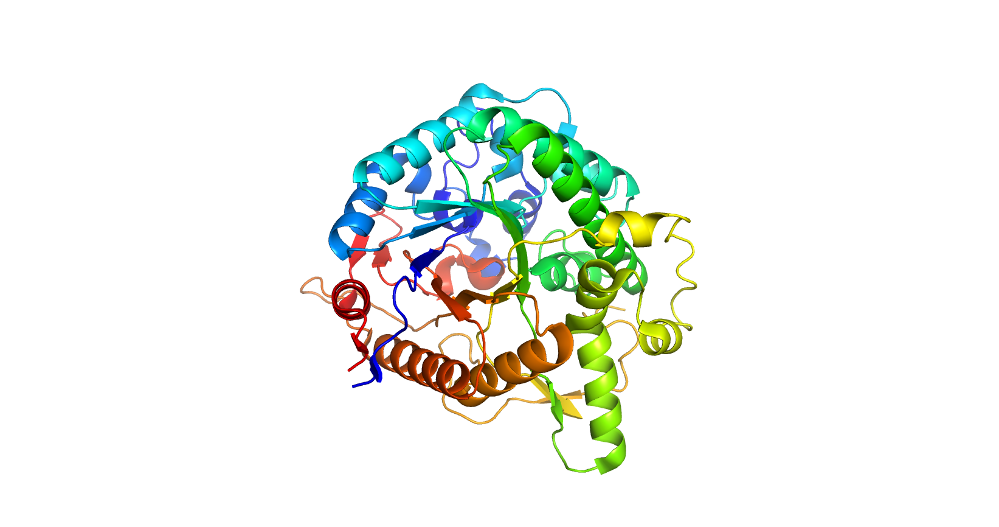
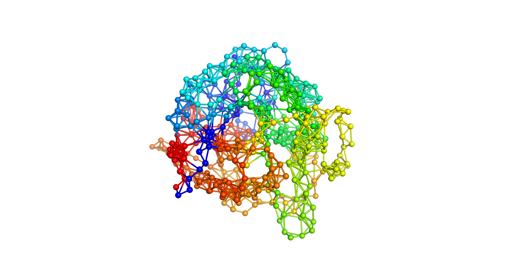

# ProteinGNN

*This project is under active developement.*

Protein structure in PDB   | Protein in graph representation
:-------------------------:|:-------------------------:
 | 

This package intends to facilitate graph neural network projects on protein structure. It supports graph data conversion
 from PDB to PyTorch format, and optionally streamlines model building, training and inference. 

The project depends on PyRosetta to recgonize bonds in protein and other bio-molecules. Although this package supports 
pip dependency in `setup.cfg`, users are recommended to install
[PyRosetta](https://www.pyrosetta.org),
[PyTorch](https://pytorch.org/), 
[PyTorch Geometric (PyG)](https://pytorch-geometric.readthedocs.io/en/latest/notes/installation.html) and 
[PyTorch_Lightning](https://www.pytorchlightning.ai/) < 1.4 independently for the best customization.

An example script is available as example.py.

### Installation
```commandline
pip install .
```

### Basic usage
Vanilla PyRosetta initialization is straightforward. It supports most protein structures.
```python
import pyrosetta
pyrosetta.init()
```

ProteinGNN supports versatile graph data building with `DatasetFactory` class which accepts user-defined node filtering,
node featurization and edge featurization.

```python
import proteingnn as pnn
from proteingnn.data import BaseNodeFilter, AtomNameNodeFilter, AtomtypeNodeFeaturizer, DistanceEdgeFeaturizer

fa_factory = pnn.data.DatasetFactory(name='CADatasetFactory')

# define node filter
fa_factory.node_filter = BaseNodeFilter()  # no filtering

# define node featurizaion 
fa_factory.node_featurizer = AtomtypeNodeFeaturizer()  # by default includes a set of PyRosetta atom names

# define edge featurization
fa_factory.edge_featurizer = DistanceEdgeFeaturizer(max_distance=3, is_edge_only=True)  # no edge features
```

Your protein graph is just one-line away.
```python
# construct your protein graph!
graph_data = fa_factory.process_graph(path_to_pdb)

# or simply save with save_graph method
fa_factory.save_graph(path_to_pdb, path_to_graph)
```

### Advanced usage
`DatasetFactory` supports parallelized graph data generation with `tdqm` progress bar for batch processing.
```python
fa_factory.predataset_path = pdb_directory
fa_factory.dataset_path = graph_directory
fa_factory.create_dataset(n_processes=NUM_PROCESSES)
```

To support non-standard molecules, PyRosetta requires optional flags and parameter files. 
```python
flags_str = pnn.data.get_pyrosetta_flags(path_to_your_flags)
pyrosetta.init(flags_str)
```

A library of node and edge featurizers is available under `proteingnn.data`. However, user-defined node and edge
featurizers can be defined by inheriting `BaseNodeFilter`, `BaseNodeFeaturizer` or `BaseEdgeFeaturizer`.

```python
from proteingnn.data import SeqEmbNodeFeaturizer, BondedEdgeFeaturizer, DistanceEdgeFeaturizer, \
    HbondEdgeFeaturizer, CompositeEdgeFeaturizer 

# only accept CA atoms
fa_factory.node_filter = AtomNameNodeFilter(atom_name_pass=['CA'], name='CA_filter')
  
# assign sequence embedding on each residue with SeqEmbNodeFeaturizer
fa_factory.node_featurizer = SeqEmbNodeFeaturizer(emb_dir=embedding_directory)

# concatenate edge features with CompositeEdgeFeaturizer
featurizers = [
        BondedEdgeFeaturizer(is_edge_only=False),
        DistanceEdgeFeaturizer(max_distance=3, is_edge_only=False),
        HbondEdgeFeaturizer(is_edge_only=False),
]
edge_featurizer = CompositeEdgeFeaturizer(
        name='CompositeEdgeFeaturizer',
        featurizers=featurizers,
        all_is_edge=False,
)
fa_factory.edge_featurizer = edge_featurizer
```

### License
This package is under MIT license and is not intended for commercial use. Creator(s) is not liable for any potential
bugs and implications.

